# How to use ONTAMA   
# 音声認識システム「おんたま」(ONTAMA: ONsei Total Analysis system by MAtsumura)の使い方   

## 「おんたま」とは   
## What is ONTAMA?   

**注意**
Win10とMac (intel cpu) では一部機能しか使えません．Mac (M1, M2)では，Pythonを使うか，自分でビルドする必要があります．   
- (mac) マイク入力は結果が保存できません．   

「おんたま」は，オフラインで音声認識(文字起こし)をするためのソフトです．
Googleドキュメントの音声入力や Word for Web (Microsoft Office 365)のディクテーションでも音声認識は可能ですが，オンラインでないと使えません．
通常の音声データであれば上記を使えば良いですが，何らかの事情でネットが使えないときや，極秘情報のため情報漏洩を防ぎたいときには，オフラインでの音声認識が必要です．
そのような時，おんたまでのオフラインでの音声認識が可能です．
音声や動画のファイルあるいはマイクの音声からのテキスト認識ができます．

**WARNING**
ONTAMA work partly on Win 10 and Mac (intel cpu).On M1 or M2 Mac, use Python or build by your self.    
- (mac) Can NOT save results from microphone input.

ONTAMA is a software for offline speech recognition (transcription) for Japanese. 
You can change languege model by modifying Python code (see how to build). 
Speech recognition is also possible using Google Docs and MS Word for Web, but only online. 
Offline speech recognition is necessary when the internet is not available, 
or when you want to prevent information leaks due to top secret. 
In these cases, you can use Ontama for offline speech recognition. 
Text recognition from audio or video files or microphone audio.

おんたまは，Voskというオフラインの音声認識ソフトとPythonを利用して作成しました．

Ontama was created using offline speech recognition software called Vosk and Python.

https://alphacephei.com/vosk/

音声認識の精度は，オンラインのツールとそれほど異ならないと思われますが，興味があるときはご自身で比較してみてください．
以下のナレーション音声のように，きれいな音声だと非常に認識精度は高いです．
しかし，開発者がふつうに話している音声だと，精度は非常に低くなります．

http://pro-video.jp/voice/announce/ (Japanese voice sample)

The accuracy of the speech recognition is not so different with online tools, 
as you can compare it yourself. 
The recognition accuracy is very high when the voice is clean. 
However, when the developer is speaking normally, the accuracy is very low.

## 免責事項   
## Disclaimer   

本ソフト「おんたま」の使用による不利益への責任は負えませんので，自己責任でご利用ください．
不具合がありましたら，松村(matutosi@konan-wu.ac.jp)にご連絡いただけると助かります．

We are not responsible for any disadvantages caused by the use of this software ONTAMA, 
so please use it at your own risk.
If you have any problems, please contact Matsumura (matutosi@konan-wu.ac.jp).

## 導入方法   
## Installation   

### USBメモリ等で ontama.exe (mac: ontama) と vosk-model がまとめて配布されている場合
### If ontama.exe (mac: ontama) and vosk-model are distributed together on a USB memory stick, etc.

ファイルの移動(コピー)だけで完了します．
アンインストールはフォルダごと削除すればOKです．

1. (win) ontama.exe と vosk-model を任意のフォルダに保存(ここでは「ontama」とする)．   
2. (mac) ontama と vosk-model をユーザのフォルダに保存(/Users/USERNAME/，USERNAMEはユーザ名)．   
3. コピーに時間がかかるので，コーヒーを飲みながら(任意)しばらく待機．   
4. 全てのファイルがコピーされると完了．   
5. mp3 や mp4 から音声認識する場合は，ffmpegをインストールする．    

ffmpegのインストール方法(ダウンロード，解凍，パスの設定)は，ネットで調べてください．

参考   
https://jp.videoproc.com/edit-convert/how-to-download-and-install-ffmpeg.htm

Move (copy) files.
Delete files to uninstall.

1. (win) Save ontama.exe and vosk-model in an arbitrary folder (in this case, "ontama").   
2. (mac) Save ontama and vosk-model in your user folder (/Users/USERNAME/，USERNAME is your username)．   
3. Wait for a while while drinking coffee (optional), as it takes time to copy the files.   
4. When all files have been copied, it is complete.   
5. Recognize mp3 or mp4 file, install ffmpeg.    

Search instalation of ffmpeg with web by your self.

ref.    
https://www.hostinger.com/tutorials/how-to-install-ffmpeg

### ontama.exe と vosk-model をインターネットから取得する場合   
### Download ontama.exe and vosk-model from the Internet   

ファイルのダウンロードと解凍・移動には時間がかかるので，コーヒーと本(あるいは他の仕事)などの準備がオススメです．

1. (win) ontama.exe を任意のフォルダに保存(ここでは「ontama」とする)．   
   https://github.com/matutosi/ontama/raw/main/dist/ontama.exe   
1. (mac) ontama をユーザのフォルダに保存(/Users/USERNAME/，USERNAMEはユーザ名)．   
   https://github.com/matutosi/ontama/raw/main/dist/ontama   
2. https://alphacephei.com/vosk/models から vosk-model-ja-0.xx.zip (xxはバージョン番号)をダウンロード．   
   vosk-model-ja-0.xx.zip   
   2023年7月現在の最新版  https://alphacephei.com/vosk/models/vosk-model-ja-0.22.zip   
   ダウンロードに結構な時間がかかるので，コーヒーを飲みながら(任意)しばらく待機．   
3. ダウンロードしたzipファイルを解凍(ここでもしばらく待機)．   
   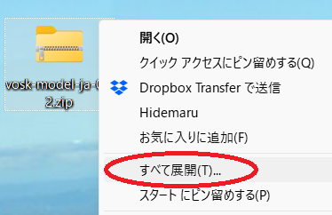    
   解凍してできたフォルダ内の「vosk-model-ja-0.xx」の名前を「model-ja」に変更．   
4. ontamaフォルダ (mac: ユーザのフォルダ) に vosk-model というフォルダを作成して，3の model-ja を vosk-model の中に全て移動．   
  ここでもしばらく待機．   
5. 全てのファイルがコピーされると完了．   
6. mp3 や mp4 から音声認識する場合は，ffmpegをインストールする．    

ffmpegのインストール方法(ダウンロード，解凍，パスの設定)は，ネットで調べてください．

Downloading, unzipping and moving files takes some long time, 
it is recommended to have coffee and a book (or other work) ready.

1. (win) Save ontama.exe in an arbitrary folder (in this case, "ontama").   
   https://github.com/matutosi/ontama/raw/main/dist/ontama.exe   
1. (mac) Save ontama in your user folder (/Users/USERNAME/，USERNAME is your username).   
   https://github.com/matutosi/ontama/raw/main/dist/ontama   
2. Download vosk-model-ja-0.xx.zip  or other language model (where xx is the version number) from https://alphacephei.com/vosk/models.   
   vosk-model-en-0.xx.zip   
   Latest version as of July 2023 https://alphacephei.com/vosk/models/vosk-model-ja-0.22.zip   
   The download takes quite a while, so have a cup of coffee (optional) and wait a while. 
3. Unzip the downloaded zip file (again, wait a while).   
   Rename "vosk-model-ja-0.xx" to "model-ja" in the extracted folder.    
4. Create a folder named vosk-model in ontama folder (mac: your user folder) and move all the model-ja from into vosk-model folder.   
   Again, wait for a while.    
5. When all the files have been copied, it is complete.   
6. Recognize mp3 or mp4 file, install ffmpeg.    

Search instalation of ffmpeg with web by your self.

ONTAMA use "./vosk-model/model-ja/" folder as model data regardless with the actual language that you use. 
So when you save model files in "./vosk-model/model-ja/" folder, ONTAMA will work. 
If you want to change folder name, see how to build.

### フォルダ・ファイル構成の概要   
### Summary of folder and file structure   

念のため，フォルダ・ファイル構成が正しいか確認すると良いです．

名前の後ろに「/」があるものはフォルダです．
model-ja の下位フォルダの内容は省略しました．

It is better to check if the folder and file structure is correct. 
Folders are those with '/' after the name.
Details are omitted.

```
(win)   ontama/   
            ├ ontama.exe  (実行ファイル execute file for win)   
            ├ ontama      (実行ファイル execute file for mac)   
            └ vosk-model/   
                └─model-ja/   
                    ├─am/   
                    ├─conf/   
                    ├─graph/   
                    ├─ivector/   
                    ├─rescore/   
                    └─README   
(mac) /User/USERNAME/   
            ├ ontama      (実行ファイル execute file for mac)   
            ├ ontama.exe  (実行ファイル execute file for win)   
            └ vosk-model/   
                └─model-ja/   
                    ├─am/   
                    ├─conf/   
                    ├─graph/   
                    ├─ivector/   
                    ├─rescore/   
                    └─README   
```

## 使い方   
## How to use   

簡単な操作で使えます．

1. ontama.exe (mac: ontama) をクリック．      
2. 黒い画面(mac: 白い画面)が現れ，少し待っているとメニューが現れる．   
   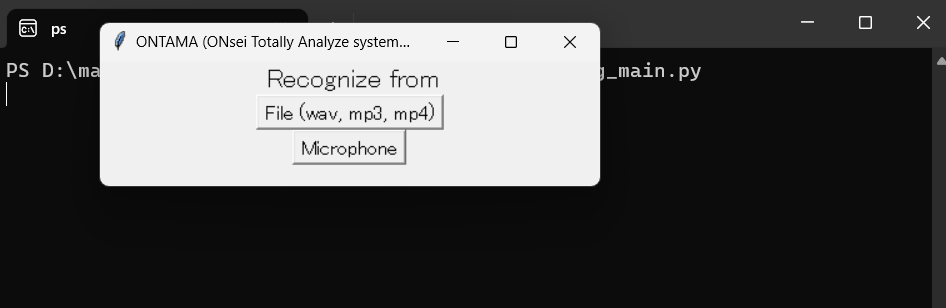    
3. 音声ファイルや動画ファイル内の音声を認識させる場合は，「File(wav, mp3, mp4)」を選択．   
  **注意**
   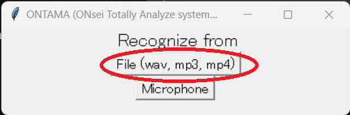    
  3-1. ファルを選択する画面がでるので，音声ファイルか動画ファイルを選択して，「開く」．   
   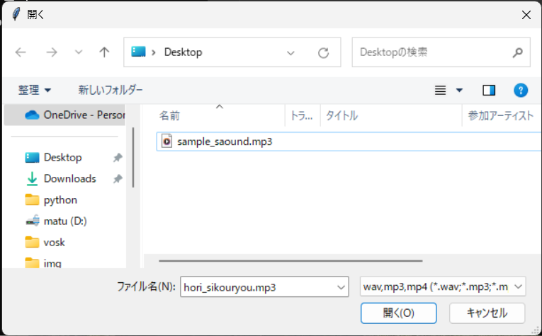    
  3-2. 2の黒い画面に，色々と実行経過が表示される．   
   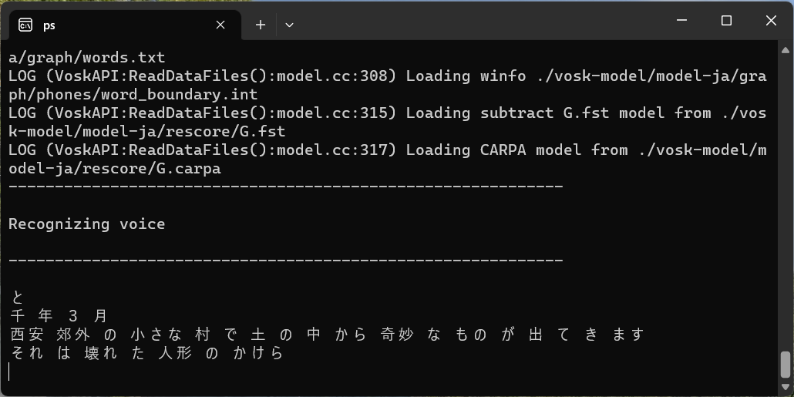    
  3-3. 3-1で選択したファイルと同じフォルダに，「FILE.docx」「FILE_plani.txt」というファイルが作成される(FILEは入力したファイルと同じ名前)．mp3とmp4の入力時は，wav形式の音声データ「FILE.wav」が生成される(不要な場合は削除する)．   
   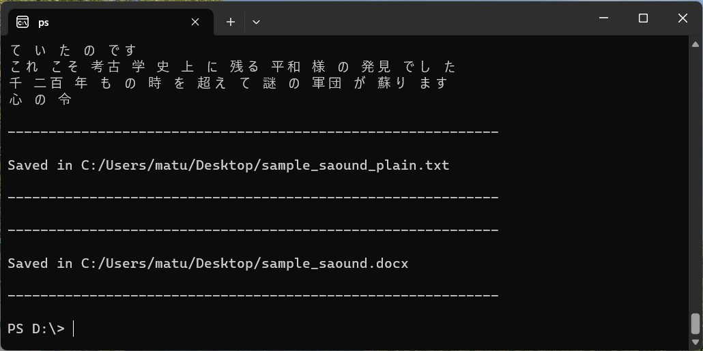    
4. パソコンのマイクから入力する音声を認識させる場合は，「Microphone」を選択．   
  **注意**
  macでは結果が保存できない．   
   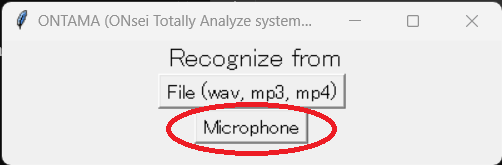    
  4-1. 2の黒い画面に色々と表示されるのでしばらく待つ．   
  4-2. 黒い画面に以下が表示されたら，マイクから音声を入力する．   
    Recognizing sound from microphone   
    Press Ctrl+C to STOP   
   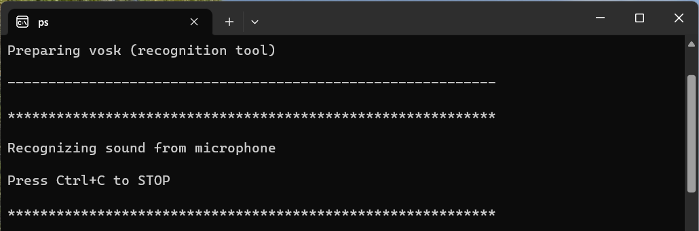    
  4-3. 認識結果が黒い画面に表示される．   
  以下の画像の「音声 認識 システム 音 玉」は自動的に表示されるものではなく，マイク音声の認識結果です．   
   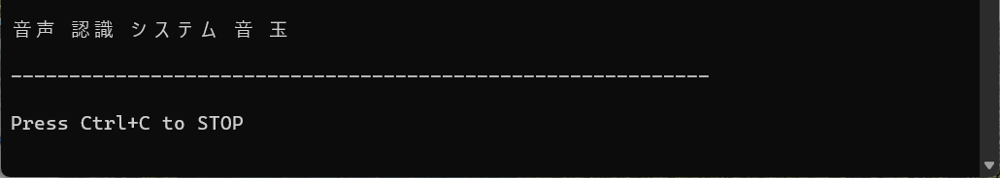    
  4-4. 終了するときは，[Ctrl] を押しながら [c] を押す．   
   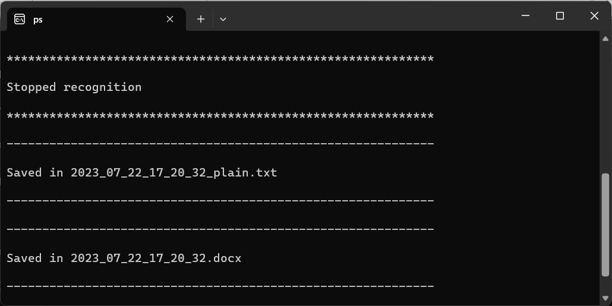    
  4-5. ontama.exe と同じフォルダに「yyyy_mm_dd_hh_mm_ss.docx」(年_月_日_時_分_秒)と「yyyy_mm_dd_hh_mm_ss_plain.txt」というファイルが作成される．   


It is easy to use.

1. Click on ontama.exe.      
2. A black (mac: whilte) screen appears, wait a moment and a menu will appear.     
3. Select "File(wav, mp3, mp4)" if you want to recognise the sound in an audio or video file.    
  **WARNING**
  3-1. A screen for selecting a file appears, select an audio or video file and click 'Open'.   
  3-2. The black screen shows the progress of the various operations.    
  3-3. "FILE.docx" and "FILE_plani.txt" files are created in the same folder as the file selected (FILE is the same name as the input file). When mp3 and mp4 input, audio data in wav format "FILE.wav" will be generated (delete if unnecessary).   
4. Select 'Microphone' if you want to recognise the sound input from the microphone of the PC.   
  **WARNING**
  (mac) Can NOT save results from microphone input.    
  4-1. Wait for a while as various displays appear on the black screen.   
  4-2. When the following appears on the black screen, input sound from the microphone.   
    Recognising sound from microphone   
    Press Ctrl+C to STOP   
  4-3. The recognition results are displayed on the black screen.   
  Press Ctrl+C to stop.     
  4-4. The files "yyyy_mm_dd_hh_mm_ss.docx" (year_month_day_hour_minute_second) and "yyyy_mm_dd_hh_mm_ss_plain.txt" are created in the same folder as ontama.exe.   

## 出力ファイルの内容   
## Contents of output files   

Wordファイル(.docx)とテキストファイル(.txt)の文字データ自体には違いはありません．
Wordファイルの場合は，認識の信頼度によってフォントが異なります．

- 高：通常   
- **中：太字**   
- __**低：太字・下線**__   

ただし，あくまでもプログラムが判定した信頼度であり，実際の音声との一致度ではありません．

   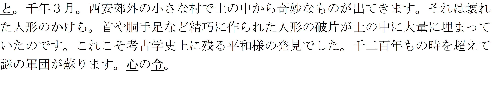

There is no difference between the string data of a Word file (.docx) and a text file (.txt).
In a Word file, the fonts differ according to the reliability of recognition.

- High: Normal   
- **Medium: bold**   
- __**Low: Bold and underlined**__   

However, this is only the confidence level determined by the programme, and not the actual speech match.


## 名前の由来(Naming: Understandable only in Japanese)

「おんたま」に大した意味はありません．
温泉玉子は美味しいのと，なんとなく可愛らしい名前にしたかっただけです．
英語(ONTAMA: ONsei Totally Analyze system by MAtsumura)は無理やりです．
あえて漢字をあてるなら，「音魂」あるいは「温玉」でしょうか．


## 番外編：システム音を認識させる

マイクの音声の代わりにシステム音(PCで流れている音)で音声認識したい場合は，2つの方法があります．
1つ目はシステム音をwavファイルとして録音してから，wavファイルを認識させる方法です．
Win11では標準で入っているサウンドレコーダを使えば良さそうです．
Pythonでは以下のURLが参考になります．

https://qiita.com/3998/items/fe7bf6f0a3be20cafdd8

2つ目はPC上の音をプログラムの入力として使う方法です．
以下が参考になります．

https://qiita.com/ShogoMatsumoto/items/73c494c15123f1084d67#pc


## Use on python (>= 3.9.0)

### Clone ontama

```
git clone https://github.com/matutosi/ontama.git
```

### Model

1. Download vosk-model-ja-0.xx.zip  or other language model (where xx is the version number) from https://alphacephei.com/vosk/models.   
   vosk-model-en-0.xx.zip   
   Latest version as of July 2023 https://alphacephei.com/vosk/models/vosk-model-ja-0.22.zip   
   The download takes quite a while, so have a cup of coffee (optional) and wait a while. 
2. Unzip the downloaded zip file.   
   Rename "vosk-model-ja-0.xx" to "model-ja" in the extracted folder.    
3. Create a folder named vosk-model in ontama folder and move all the model-ja from into vosk-model folder.   
   Again, wait for a while.    

### Libraries

(win and mac)

```
pip install --upgrade pip
pip install ffmpeg-python
pip install pyinstaller
pip install python-docx
pip install soundcard
pip install sounddevice
pip install vosk
```

(mac) When installed Python with homebrew.

brew install python-tk

### Run

```
python recog_main.py
```

## How to build ontama with Python

### Clone ontama

```
git clone https://github.com/matutosi/ontama.git
```

### Model

1. Download vosk-model-ja-0.xx.zip  or other language model (where xx is the version number) from https://alphacephei.com/vosk/models.   
   vosk-model-en-0.xx.zip   
   Latest version as of July 2023 https://alphacephei.com/vosk/models/vosk-model-ja-0.22.zip   
   The download takes quite a while, so have a cup of coffee (optional) and wait a while. 
2. Unzip the downloaded zip file.   
   Rename "vosk-model-ja-0.xx" to "model-ja" in the extracted folder.    
3. Create a folder named vosk-model in ontama folder and move all the model-ja from into vosk-model folder.   
   Again, wait for a while.    

### Modify codes (optional)

If you want to change language model, modify codes as bellow. 

- recog_mic.py   
- voice_recog.py   

```
model = Model("./vosk-model/model-ja")
```

You can change other codes as you like.


### Vertial environment

Opstional but RECOMMENDED to reduce execute file.

(win)
```
python -m venv ontama
ontama\Scripts\Activate
```

(mac)
```
python -m venv ontama
source ontama/bin/Activate
```

### Libraries

(win and mac)

```
pip install --upgrade pip
pip install ffmpeg-python
pip install pyinstaller
pip install python-docx
pip install soundcard
pip install sounddevice
pip install vosk
```

(mac) When installed Python with homebrew.

```
brew install python-tk
```


### pyinstaller

Create setting file (*.spec).

```
pyi-makespec recog_main.py -n ontama --onefile
```

Modify data setting in recog_main.spec file.

```
before: datas = [],
after : datas = [('SET_YOUR_PATH', './vosk')],
(win ex.) : datas = [('c:\\..\\ontama\\Lib\\site-packages\\vosk', './vosk')],
(mac ex.) : datas = [('/Users/../ontama/lib/python3.10/site-packages/vosk', './vosk')],
```

Create execute file.

```
pyinstaller ontama.spec
```

Wait for moments to finish.
